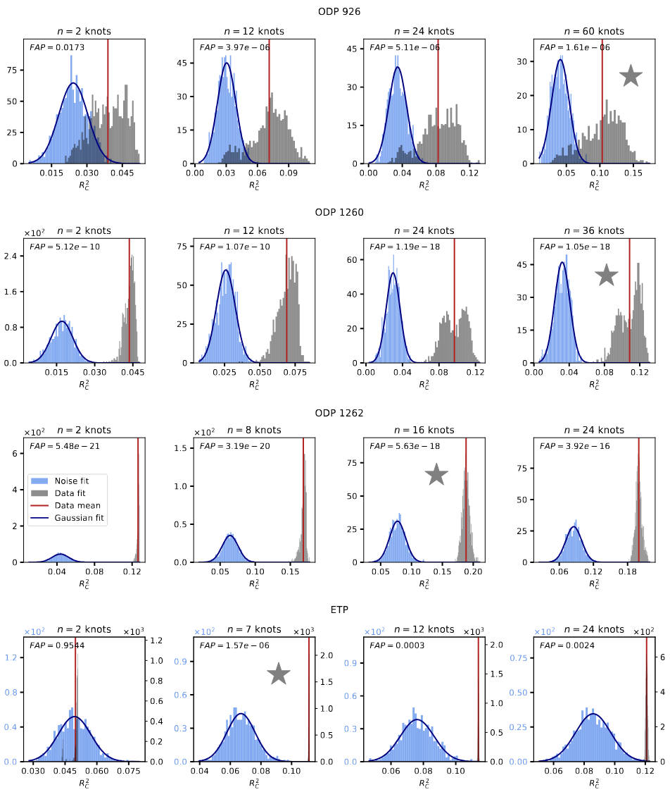

.. _figures_post_significance:

Figures Obtained with the Significance Test Results
====================================================

.. image:: https://img.shields.io/badge/python-3.11%2B-blue
    :alt: Python Version

.. image:: https://img.shields.io/badge/license-GPLv3-blue
    :alt: License
    
----

Significance Test Plot
----------------------

This figure provides a visual diagnostic for testing the significance of model fits to geophysical data, based on a Monte Carlo simulation framework. Each panel corresponds to a different dataset and model complexity, and illustrates whether the observed fit can be reasonably attributed to noise or not.

This figure helps to determine whether a fitted model captures genuine signal features or whether its performance can be explained as fitting random noise.

