.. _figures_post_fitting:

Figures Obtained with the Fitting Results
=========================================

.. image:: https://img.shields.io/badge/python-3.11%2B-blue
    :alt: Python Version

.. image:: https://img.shields.io/badge/license-GPLv3-blue
    :alt: License
    
Metric Value per Result and Number of Genes Plot
------------------------------------------------

This plot shows how a genetic algorithm (GA) improves model fit over generations for different levels of model complexity, measured by the number of knots. The x-axis represents the number of generations, segmented by knot values, and the y-axis shows the log-likelihood, a metric indicating how well the model fits the data (higher is better). For each knot value, the GA runs for a fixed number of generations (e.g., 200), trying to improve solutions within a population of fixed size (e.g., 200). Colored lines represent independent GA runs, with red indicating better solutions. The plot allows users to assess how the fit evolves, compare performance across complexities, and check the consistency of results between multiple runs.

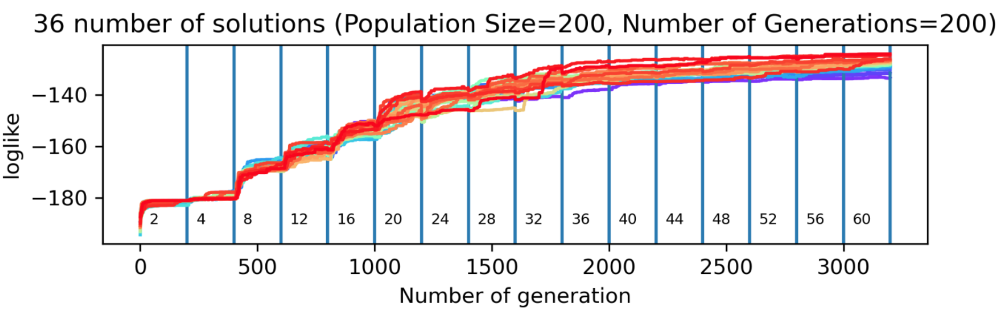

----

AICs BICs Metrics of the Fitting Results Plot
---------------------------------------------

Different genetic algorithm (GA) solutions are represented by a color gradient ranging from red to purple, where red corresponds to the best-performing solutions. 
A black line is used to indicate the envelope formed by the lowest AIC or BIC values across the range of knot numbers.  This visualization helps identify the most appropriate number of knots, 
which should correspond to a region where AIC/BIC values are relatively low—striking a balance between underfitting and overfitting.

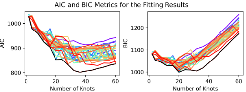

----

AICs and Choosen Metric of the Fitting Results Plot
---------------------------------------------------

This plot illustrates the relationship between the number of knots and two key metrics: AIC and R². The AIC (Akaike Information Criterion), where lower values indicate a better balance between model fit and complexity, 
helps guide the selection of the optimal number of knots. Alongside this, the R² metric provides an overview of the goodness of fit between the data and the model across different knot configurations, 
with higher values indicating a better fit. Together, these metrics assist in identifying the most appropriate number of knots for the model.

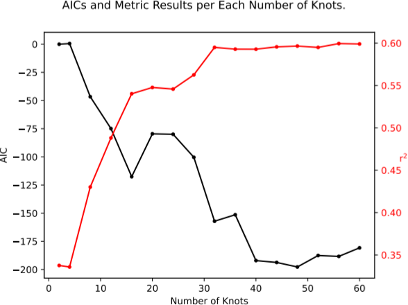

----

Fitted Function of The Inverse Sedimentation Rate in front of the Nominal Solution (If Added)
---------------------------------------------------------------------------------------------

This plot shows the inverse sedimentation rate as a function of depth for different numbers of knots. Colored lines represent the genetic algorithm (GA) solutions, ranging from red to purple, 
with red indicating the best-fitting solution. The nominal solution, if provided, is shown in black for comparison.

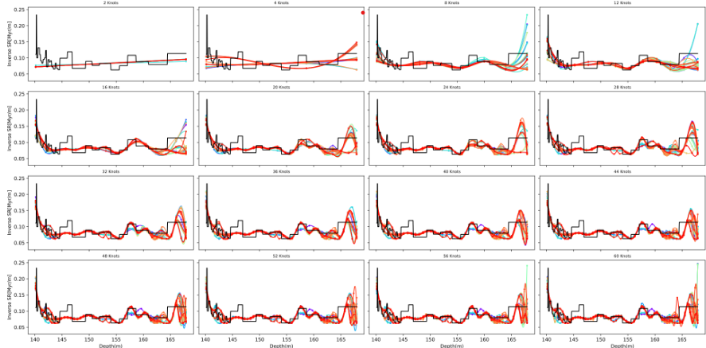

----

Summary of the Results
----------------------

This figure presents the results of a Genetic Algorithm (GA)-based inverse modelling approach to estimate sedimentation rates and corresponding age-depth models. The results are summarized across four panels:

a) Inverse Sedimentation Rate Solutions in Function of Depth
~~~~~~~~~~~~~~~~~~~~~~~~~~~~~~~~~~~~~~~~~~~~~~~~~~~~~~~~~~~~
This panel illustrates the **inverse sedimentation rate profiles** as a function of depth, expressed in [kyr/m]. Multiple colored lines represent different GA solutions, where:
- **Red curves** correspond to the best solutions (highest fitness).
- **Purple curves** indicate less optimal solutions.
- The **black line** shows the **nominal solution** used as a reference.

b) Reconstructed Functions Time-Depth
~~~~~~~~~~~~~~~~~~~~~~~~~~~~~~~~~~~~~
This panel displays the **reconstructed age-depth models** derived from the inverse sedimentation rates. The nominal solution is again shown in black for comparison.

c) Reconstructed Solutions Over Data
~~~~~~~~~~~~~~~~~~~~~~~~~~~~~~~~~~~~
In this subplot, the model reconstructions are compared against the **original dataset**:
- The **original data** is shown in **blue**.
- The **black line** represents the signal reconstructed using the GA solutions.

d) Correlation Coefficient Per Solution Over Depth
~~~~~~~~~~~~~~~~~~~~~~~~~~~~~~~~~~~~~~~~~~~~~~~~~~
This panel assesses the **goodness-of-fit** for each GA solution across depth:
- Each line represents the **correlation coefficient** between a GA model's output and the original data at different depths.
- The **best solutions** appear in red and warm colors, while the **worst solutions** appear in purple and cold colors.

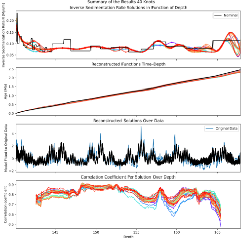

----

Fitted Function of the Inverse Sedimentation Rate with the Interval of Confidence Obtained Through All the Solutions in front of the Nominal Solution (if added).
------------------------------------------------------------------------------------------------------------------------------------------------------------------

This figure shows the **inverse sedimentation rate (in kyr/m)** as a function of depth, incorporating statistical summaries derived from 36 user-defined Genetic Algorithm (GA) solutions.
This plot communicates the **uncertainty and variability** in the estimated inverse sedimentation rates:

- **Black line (Nominal)**: The nominal or reference inverse sedimentation rate model.
- **Blue line (Median)**: The median of the inverse sedimentation rates from all 36 GA solutions, representing the central trend of the ensemble.
- **Shaded bands**:
  - **Dark blue band**: 50% Confidence Interval (CI) — the interquartile range where half the solutions lie.
  - **Light orange band**: 90% Confidence Interval (CI) — spans a broader range to encompass most of the model variability across all solutions.

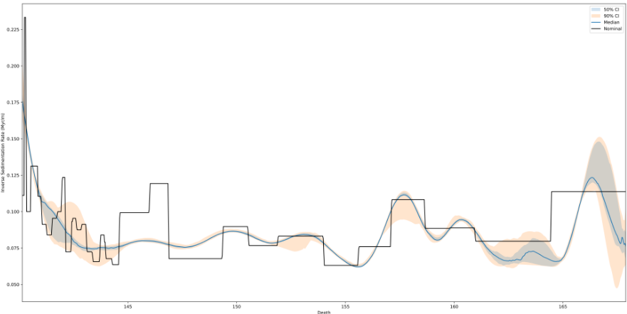

----

Frequency Spectrum
------------------
Frequency spectrum of a time series transformed through a time-depth conversion (e.g., using an age-depth model). The horizontal axis represents frequency (typically in cycles per million years), while the vertical axis shows the normalized power or amplitude associated with each frequency component.

Dashed vertical lines indicate reference astronomical frequencies, which may include components of Earth's orbital variations such as eccentricity, obliquity or axial tilt, and climatic precession . These markers allow visual comparison between the detected signal and known Milankovitch cycles.

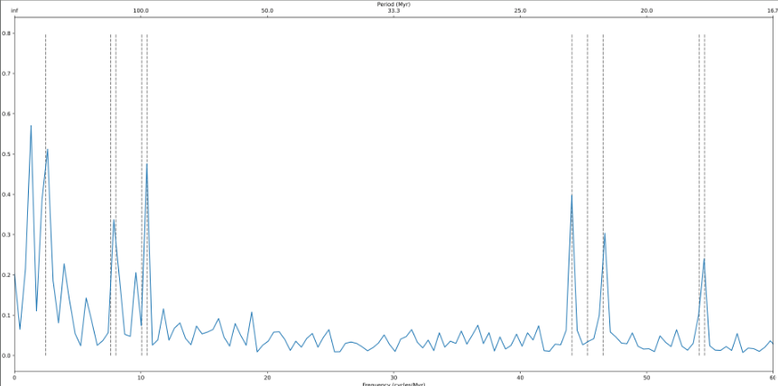

----

Depth series vs. Tuned Time series
----------------------------------

Comparison between a tuned model and the original data, shown in both the depth and time domains. The top panel displays the raw data (blue) and the fitted model (black) along a depth axis (in meters), representing the original depth-series input. The bottom panel presents the same comparison after transforming the depth-domain data into the time domain (in millions of years, Myr), using a time-depth transfer function (e.g., an age-depth model).

The black curve represents the best-fit model generated by a tuning algorithm, such as a genetic algorithm (GA), optimized for a given number of spline knots or fit parameters. The blue curve shows the unmodified original dataset.

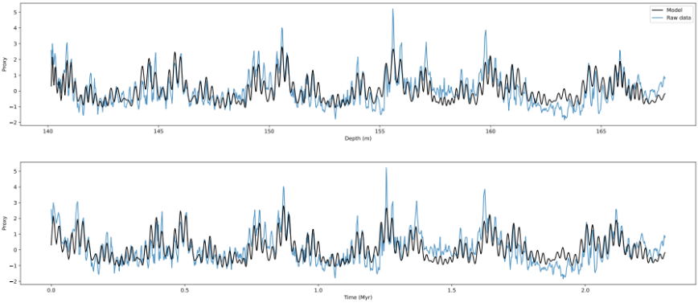

----

Correlation Between Eccentricity and Precession Envelope
--------------------------------------------------------

This figure presents the relationship between **eccentricity (ecc)**, **climatic precession (prec)**, and the **precession envelope (env prec)**. The signals  are extracted from the best Genetic Algorithm (GA) solution generated for a the chosen number of knots.

- **prec** (blue): The raw climatic precession signal.
- **env prec** (orange): The upper envelope of the climatic precession signal.
- **ecc** (green): The orbital eccentricity signal.

The overlay of the three curves illustrates the relationship between **eccentricity**, **climatic precession**, and the **precession envelope**. In typical astrochronological analysis:

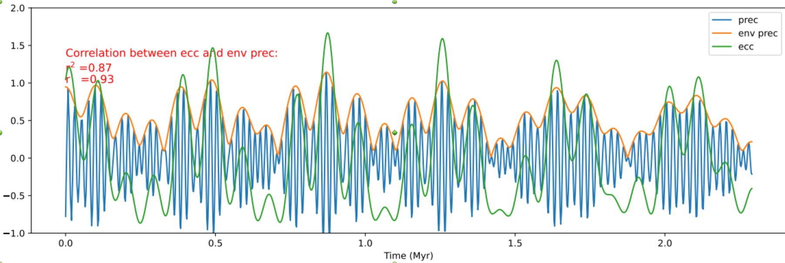

----

Absolute Time Determination
---------------------------

Mean squared weighted deviation (MSWD) analysis to determine the optimal time offset for aligning a floating time scale with a reference astronomical solution (e.g., La2010b). The horizontal axis represents candidate offset values for the starting time `t₀` (in Ma), while the vertical axis shows the corresponding MSWD values.

The top panel compares MSWD values derived from the difference in eccentricity components (e.g., gi-gj) between the dataset and the astronomical solution. The bottom panel shows MSWD values for the precession envelope comparison.

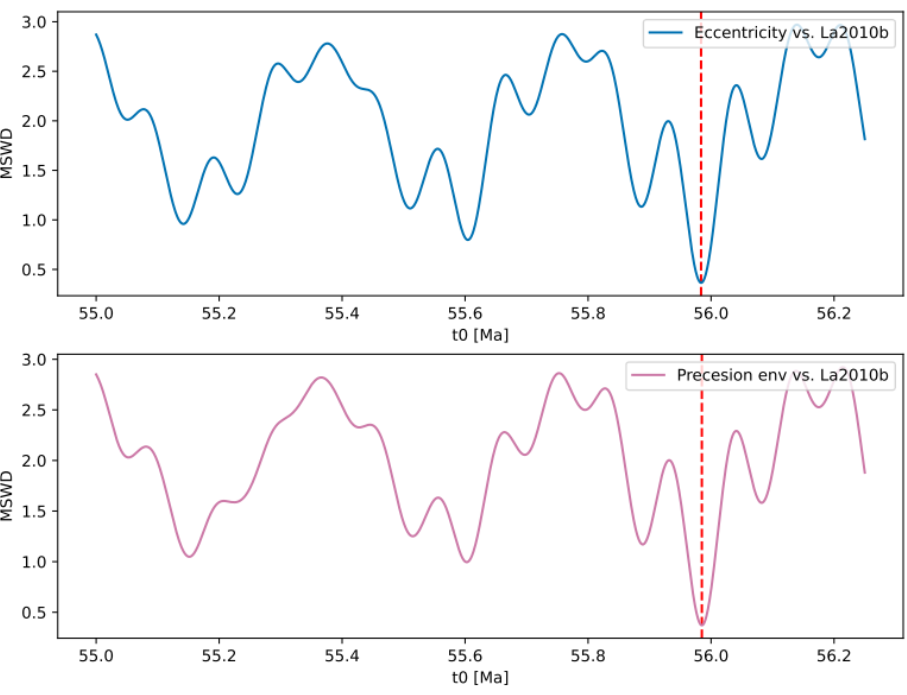

----

Correlation with Astronomical Solution
--------------------------------------

Correlation between orbital parameters reconstructed from stratigraphic data and a reference astronomical solution (e.g., La2010b). This figure is used to evaluate the quality of time calibration based on how well the data-derived signal matches theoretical orbital patterns.

The top panel compares the reconstructed eccentricity (blue curve) with the reference La2010b eccentricity curve (black), while the bottom panel compares the precession envelope (pink curve) derived from the data with the corresponding component from the astronomical solution.

Pearson correlation coefficients (r) and coefficients of determination (r²) are displayed in the top-left of each panel, quantifying the degree of similarity. A red dashed vertical line marks the nominal time offset previously determined using MSWD analysis.

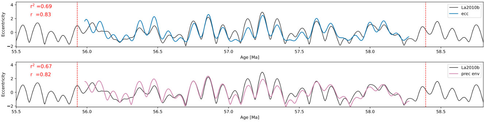