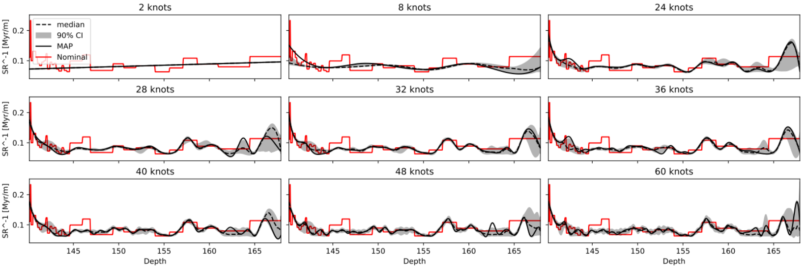
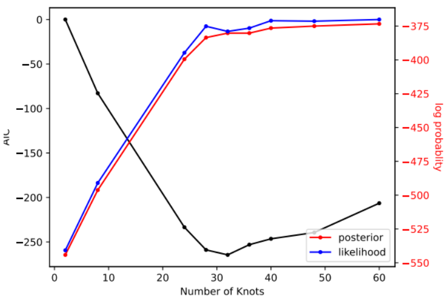
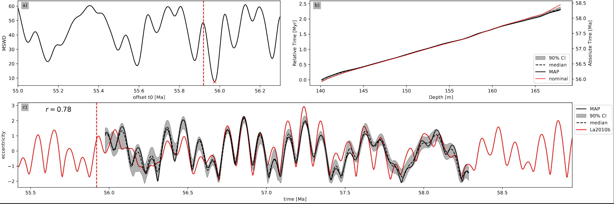
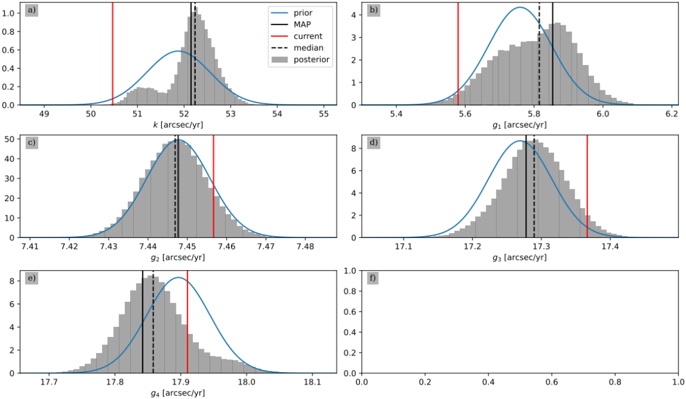
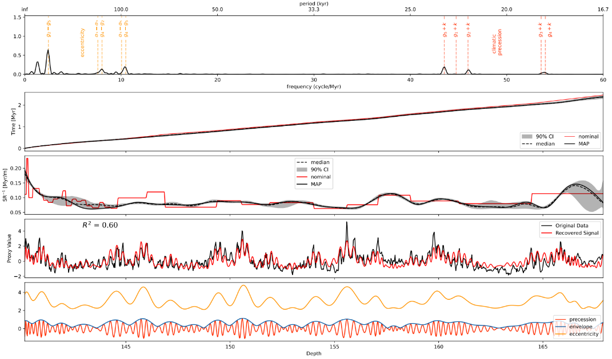
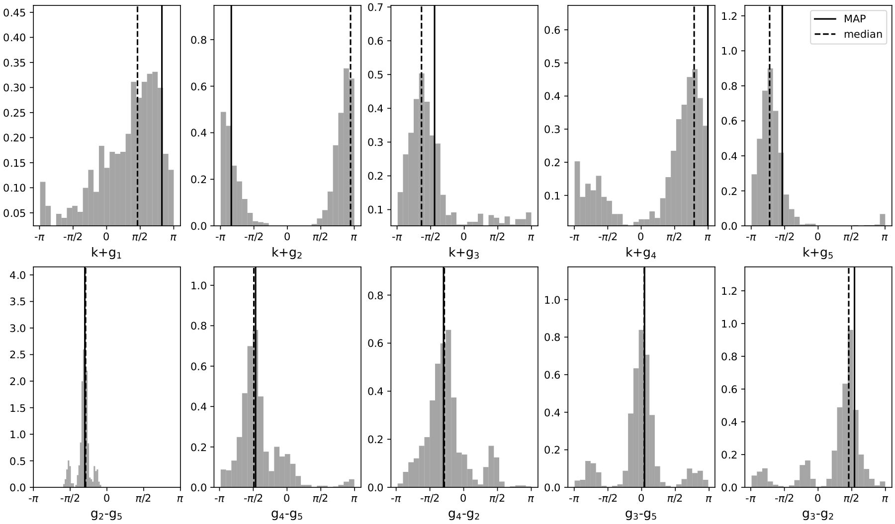

.. _figures_post_mcmc:

Figures Obtained with the MCMC Results
======================================

.. image:: https://img.shields.io/badge/python-3.11%2B-blue
    :alt: Python Version

.. image:: https://img.shields.io/badge/license-GPLv3-blue
    :alt: License

Sedimentation Rate and Incertitude per each Number Of Knots
-----------------------------------------------------------

Inverse sedimentation rate profiles (SR⁻¹, in Myr/m) plotted as a function of depth, for a range of age-depth model complexities represented by different numbers of knots. Each subplot corresponds to a model fit using a specific number of knots, illustrating how the complexity of the model influences the resolution and uncertainty of the estimated sedimentation rates.

The black dashed line represents the median of the posterior distribution from a Markov Chain Monte Carlo (MCMC) simulation. The solid black line shows the Maximum a Posteriori (MAP) estimate, while the gray shaded area denotes the 90% confidence interval, capturing the uncertainty of the model. For comparison, the red stepwise line represents a nominal reference solution.

----

AIC's and Metric Results per Each Number Of Knots
-------------------------------------------------

Model performance metrics plotted as a function of the number of knots used in an age-depth modeling framework. The black curve represents the Akaike Information Criterion (AIC), which serves as a model selection criterion where lower values indicate better balance between model complexity and fit.

The red and blue curves correspond to the log posterior and log likelihood values, respectively, plotted against the right-hand vertical axis. These metrics provide insight into the overall goodness-of-fit (likelihood) and the plausibility of the model given the data and priors (posterior).

----

Eccentricity Solution
---------------------

Composite figure illustrating the process of tuning a floating time scale to an astronomical reference through eccentricity correlation and MSWD minimization.

a) Mean Squared Weighted Deviation (MSWD) values between the Maximum a Posteriori (MAP) solution derived from the data and a reference astronomical solution (e.g., La2010b), as a function of time offset. The red dashed vertical line and star marker indicate the optimal offset corresponding to the minimum MSWD.

b) Age-depth model showing the relationship between depth (in meters) and relative or absolute time (in Myr). The black dashed line represents the median of the posterior distribution, the solid black line indicates the MAP solution, the red line shows the nominal (prior) model, and the shaded region marks the 90% confidence interval.

c) Comparison between the reconstructed eccentricity signal from the tuned time series (black) and the reference astronomical solution (red). The correlation coefficient (r) quantifies the degree of match between the two curves, and the shaded envelope around the MAP solution shows the uncertainty range.

----

Frequency Distributions
-----------------------
Posterior distributions of selected astronomical parameters derived from Markov Chain Monte Carlo (MCMC) simulation, including Earth's axial precession constant (k) and the fundamental secular frequencies of planetary orbits (g₁ to g₄, s3 and s4) that are added to the prior mcmc calcula. Each panel (a–e) displays a histogram of the posterior distribution (gray), the prior distribution (blue curve), and key statistical markers:

- **Black solid line**: Maximum a Posteriori (MAP) estimate.
- **Black dashed line**: Posterior median.
- **Red vertical line**: Current nominal value used for comparison.

----

Miscellanious Figure
--------------------

Multi-panel figure summarizing the results of orbital tuning and Bayesian age modeling based on sedimentary proxy data and astronomical forcing functions.

a) Power spectrum of the Maximum a Posteriori (MAP) tuned time series, with frequency (in cycles/Myr) and period (in kyr) labeled. Overplotted are reference orbital frequencies, including eccentricity (g-terms), climatic precession (g + k terms), and obliquity (s-terms).

b) Resulting age-depth model. The black line represents the MAP estimate, the dashed line the posterior median, the shaded area the 90% confidence interval, and the red line the nominal (prior) model.

c) Inverse sedimentation rate (SR⁻¹) as a function of depth. The same visual conventions as panel (b) are used for uncertainty and reference models.

d) Comparison between the observed proxy data (black) and the recovered signal derived from the tuned model (red). The fit between the two reflects the degree of signal preservation and model accuracy, quantified by the R² value.

e) Orbital components extracted from the astronomical solution and plotted against depth: eccentricity, obliquity (tilt), climatic precession, and the precession envelope. These components are used for signal alignment and model forcing.

----

Phase Plot
----------

Posterior distributions of orbital phase angles derived from a Markov Chain Monte Carlo (MCMC) analysis, expressed in radians. The histograms represent uncertainty in the phase of key astronomical components inferred from the sedimentary record.

- **Top row**: Climatic precession phases (k + g₁ to k + g₅), where *k* is Earth's axial precession frequency and *gᵢ* are secular frequencies of planetary orbits. These correspond to the modulation of precession signals in stratigraphy.
   
- **Bottom row**: Eccentricity phase differences (gᵢ − gⱼ), such as g₂ − g₅, g₄ − g₅, and others, representing phase offsets in the long-term modulation of eccentricity cycles.

Vertical lines indicate key statistical markers:
- **Black dashed line**: Posterior median phase.
- **Black solid line**: Maximum a Posteriori (MAP) estimate.

